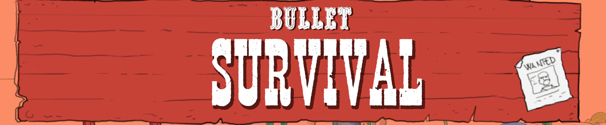

# 🎮 BULLET SURVIVAL

Bullet Survival is a fast-paced survival game where you play as a lone cowboy fighting against endless waves of hostile cowboys. Dodge bullets, stay on the move, and survive as long as possible while the horde grows stronger with each wave.


## 📖 About

Describe your game here. Explain the objective, gameplay, inspiration, and what makes it unique.

Example:
> A fast-paced arcade game where players dodge obstacles, collect coins, and survive as long as possible.

---

## ✨ Features

- 🎯 Feature 1
- 🎮 Feature 2
- 🏆 High score system
- 🔊 Sound effects and music
- 💾 Save system

---

## 📸 Screenshots

### Main Menu


### Gameplay


### Game Over Screen


---

## 🛠️ Built With

- Unity 6
- C#
- Visual Studio
- Git & GitHub

---

## 🎮 Controls

| Action | Key |
|----------|----------|
| Move Left | A / Left Arrow |
| Move Right | D / Right Arrow |
| Jump | Space |
| Pause | Esc |

---

## 🚀 Installation

1. Clone the repository:
   ```bash
   git clone https://github.com/yourusername/game-name.git
   ```

2. Open the project in Unity.

3. Press Play or build the game.

---

## 📂 Project Structure

```text
Assets/
├── Scripts/
├── Prefabs/
├── Sprites/
├── Audio/
├── Scenes/
└── UI/
```

---

## 🎯 Future Improvements

- [ ] Add more levels
- [ ] Multiplayer support
- [ ] Achievement system
- [ ] Mobile version

---

## 🐛 Known Issues

- Issue 1
- Issue 2

---

## 👨‍💻 Developer

**Taki Kishala**

- GitHub: https://github.com/yourusername
- LinkedIn: https://linkedin.com/in/yourprofile

---

## 📜 License

This project is licensed under the MIT License - see the LICENSE file for details.

---

## ⭐ Support

If you like this project, consider giving it a star ⭐ on GitHub!
