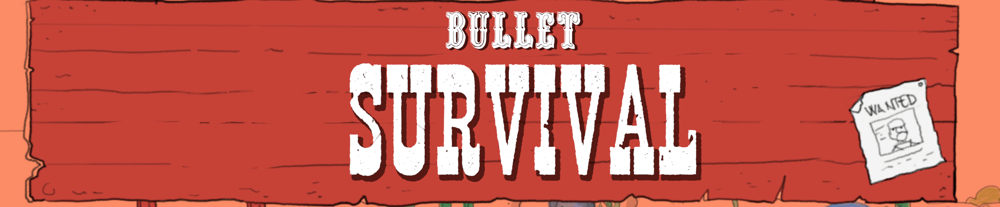
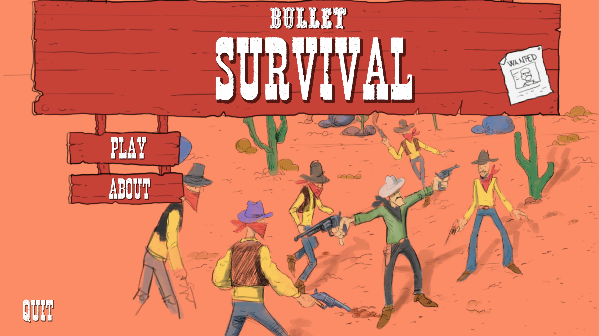
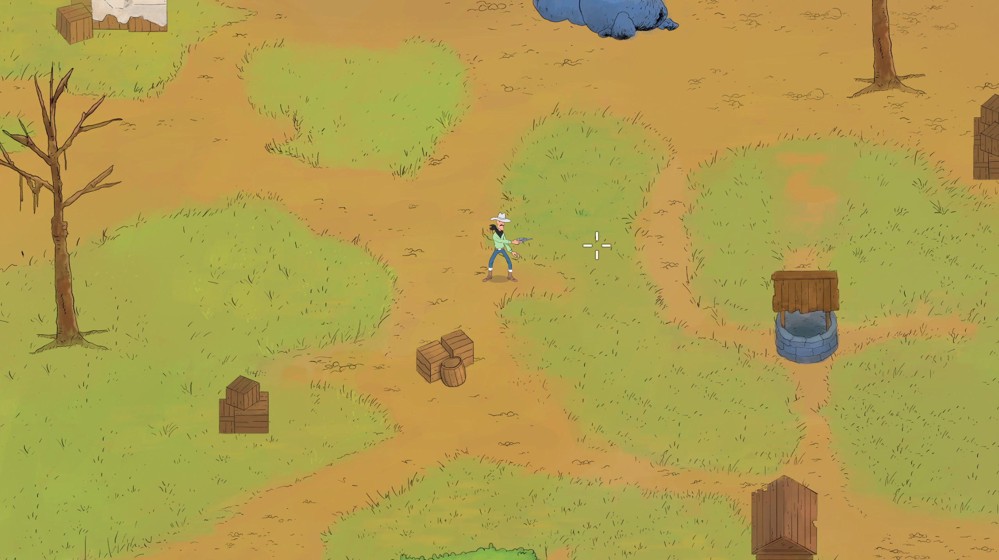
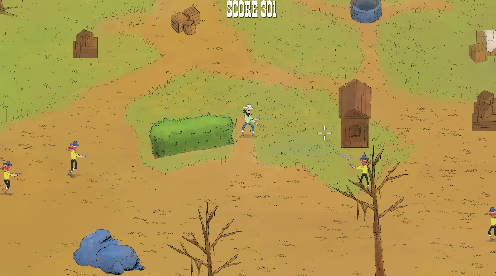
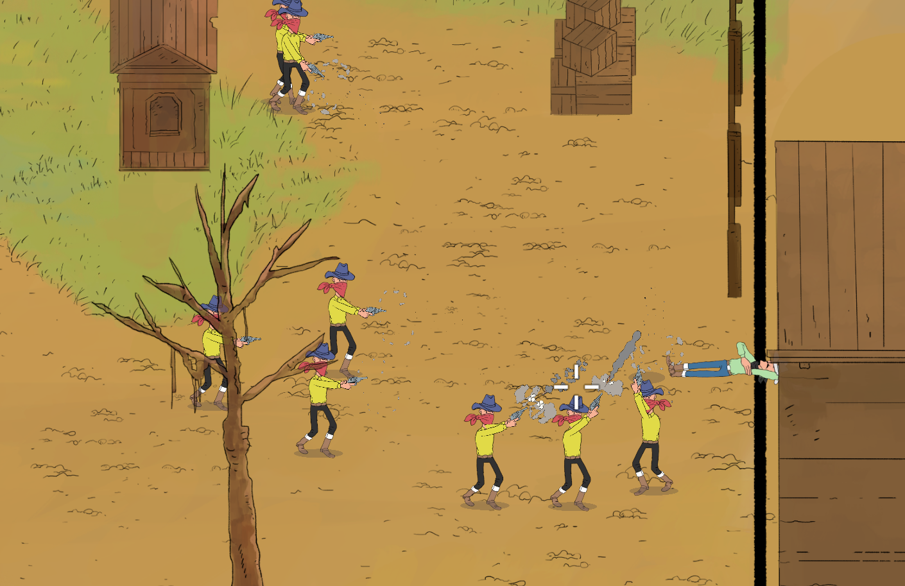

# Bullet Survival

**Version 0.0.2** — a personal 2D survival shooter built with Unity and C# by Taki Kishala, with original 2D artwork.

[Watch gameplay](https://youtu.be/54X2zxvfbJ8)

Fight hostile cowboys, dodge incoming shots, and earn points by defeating enemies.

## Features

- Player movement, mouse aiming, and shooting.
- Enemy AI, spawning, and population limits.
- Reusable bullet and smoke object pools.
- Scoring, pause/resume, death, game-over, and restart flows.
- Original 2D artwork, animations, sound effects, and camera shake.

## Update 0.0.2

- Updated source, scenes, prefabs, and smoke animation to match the current working project.
- Pooled bullets reset their lifetime and hit state on activation.
- A per-shot hit guard prevents one bullet from killing multiple stacked enemies.
- Rigidbody2D bullet movement and continuous collision detection address missed fast-projectile collisions.
- Removed unused variables, methods, imports, and commented experiments.

See [CHANGELOG.md](CHANGELOG.md) for validation details.

## Controls

| Action | Input |
| --- | --- |
| Move | WASD / arrow keys |
| Aim | Mouse |
| Shoot | Left mouse button |
| Pause / resume | Escape |
| Restart | Game-over screen button |

## Open the project

1. Clone this repository.
2. Add the project folder in Unity Hub and open it with **Unity 6000.3.5f1**.
3. Open `Assets/Scenes/Main menu.unity` and press Play.

Unity generates Library and other caches locally; they are excluded from Git.
This update publishes the Unity project source, not a standalone game build.

## Screenshots

## Developer

[Taki Kishala](https://github.com/TakiKishala) — programming and original 2D artwork.
